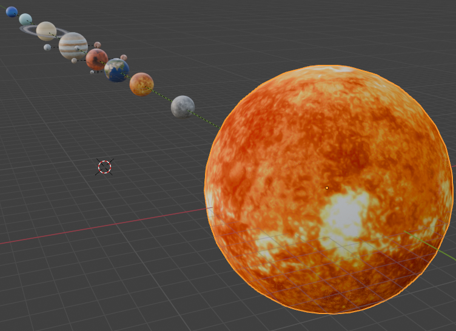
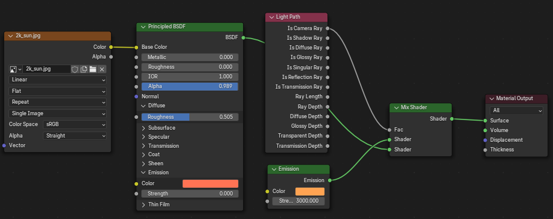

# 🌌 Solar System

> Progetto di Computer Graphics – Anno Accademico 2024/2025  
> Università: Roma TRE
> Curriculum: Intelligenza artificiale e Machine Learning
> Corso: Computer Graphics 
> Autore: **Paolo Tardioli**  
> Matricola: **571467**  
> Progetto svolto: **Individuale** 

---

## 📖 Descrizione

**Solar System** è un progetto di modellazione e animazione 3D del sistema solare, realizzato come elaborato per il corso di Computer Graphics.  
La scena rappresenta i pianeti principali, le loro lune e il Sole, con proporzioni e distanze semplificate, ma animazioni coerenti che simulano i moti orbitali e di rotazione.

---

## 🛠️ Tecnologie Utilizzate

- **Blender** – Modellazione 3D, animazione, gestione della camera e illuminazione
- **ClipVideo** - Concatenazione delle clip per ottenere il render finale
---

## 🎮 Come Usarlo

1. Apri il file `solar_system.blend` con Blender (versione consigliata: es. 4.1).
2. Premi `Numpad 0` per entrare nella visuale della camera.
3. Premi `Spacebar` per avviare l'animazione.
4. Esplora liberamente la scena anche in modalità viewport (`Middle Mouse`, `Shift`, `Alt`).

---

## ⏱️ Durata Animazione

L’animazione si estende su **1250 frame**.  
Con un frame rate di **60 fps**, la durata complessiva è di circa **41 secondi** (video rallentato a 0.5x).

---

## 📽️ Struttura dell'Animazione

La scena è composta da **pianeti**, **lune** e **il Sole**, tutti modellati come oggetti **Sphere**.

- Ogni corpo celeste ha una **rotazione attorno al proprio asse**.
- Le **lune** ruotano attorno ai rispettivi **pianeti**.
- I **pianeti** ruotano in orbita attorno al **Sole**.
- Gli **anelli di Saturno**, creati come un **disco forato**, ruotano intorno al pianeta stesso.

### Movimento della telecamera:

1. **Panoramica iniziale**: la camera si muove frontalmente attraversando la scena per mostrare tutti i corpi celesti.
2. **Inquadratura globale**: si allontana per inquadrare l’intero sistema solare per poi riavvicinarsi agli elementi di scena mostrando una inquadratura semi laterale.

---

## 💡 Illuminazione della Scena

Il **Sole** funge da fonte di **illuminazione radiale**, distribuita uniformemente in tutte le direzioni a partire dalla sua superficie.  
Questo consente di ottenere una luce coerente su tutti gli oggetti della scena, simulando una fonte luminosa centrale naturale.

---

## 🎨 Texture dei Pianeti

Le texture utilizzate provengono da:  
**[Solar System Scope Textures](https://www.solarsystemscope.com/textures/)**  
Licenza: **Creative Commons Attribution 4.0 International (CC‑BY 4.0)**

Le texture sono **immagini rettangolari equirettangolari** (UV map) applicate sulla superficie degli oggetti **Sphere** per simulare l’aspetto realistico di pianeti e lune.

> *“Earth texture by Solar System Scope, CC‑BY 4.0 — https://www.solarsystemscope.com/textures/”*

---

## 📁 File Inclusi

- `model/` – Cartella contenente il file `.blend` principale del progetto.
- `model.blend1` – Backup automatico del file Blender.
- `textures/` – Cartella contenente le texture dei pianeti.
- `solarsystem.mkv` – Video finale dell’animazione completa del sistema solare (frame 0–1250)
- `SolarSystem_0_600.mkv` – Prima parte dell’animazione (frame 0–600).
- `SolarSystem_600_1250.mkv` – Seconda parte dell’animazione (frame 600–1250).
- `README.md` – Documento descrittivo del progetto e delle sue componenti.

> Le due clip parziali sono state concatenate per formare il video `solarsystem.mkv` usando clipvideo.com.

---

## 📌 Note Finali

La scala, le dimensioni e le traiettorie sono state **semplificate** per garantire una resa visiva chiara e funzionale alla presentazione dei concetti base del sistema solare in ambito 3D.

---
